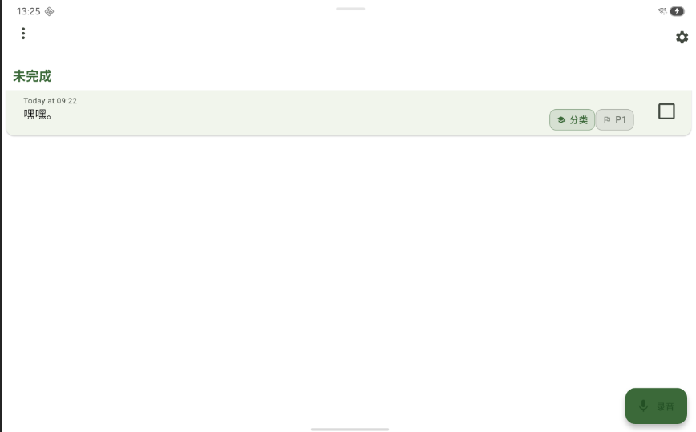

UI的排布

1. 在AppBar的左上角添加"更多"三个点,独立于具体的代办,功能是点击触发新的下拉菜单,里面有排序,选择的入口
2. 去除代办前面的选择框,选择统一移动到"更多"里面的,点击选择之后设置按钮变成取消(选择)按钮,点击后恢复到一般状态,按钮恢复为设置
3. 减小tile高度,同时增大内部文字的字号,分类和优先级移动到checkbox之前,位置更加靠上(同时告诉我如果我自己想要调整,代码在哪里)
4. 如果没有分类和优先级,就不显示分类和优先级,只有分类就只显示分类,只有优先级就只显示优先级
5. 点击tile从左往右2/3往右的部分(即x从两个标签开始到结束的部分),但是checkbox左边的部分,跳转到设置catagory和priority的界面(这个界面我们下一步再进一步设计),点击文字部分,跳转到编辑文字

## 最终效果图参考
