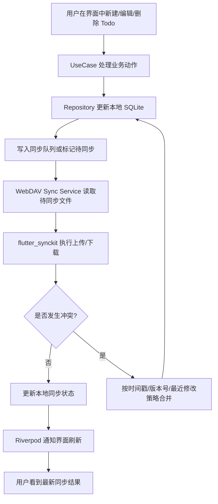

# Todo 云端同步插件提案

如果这个项目要做的是基于 WebDAV 的文件型 todo 云端同步，而不是数据库同步，那么最贴合当前技术栈的插件是 `flutter_synckit`。

原因如下：

- 这个项目本身已经是 Flutter + Riverpod + 本地 `sqflite` 的组合，`flutter_synckit` 更适合在现有本地优先架构上加一层 WebDAV 同步，而不是把整套数据层换成数据库服务。
- `flutter_synckit` 的定位就是集成 WebDAV 的轻量同步库，支持离线优先、断点续传和冲突处理，和“todo 文件同步”的需求匹配度更高。
- 如果 todo 以文件或可导出的结构存储，WebDAV 更适合做跨设备文件同步、备份和恢复，而不是强依赖云端表结构。
- 当前项目已经有 `http`、`shared_preferences`、`flutter_riverpod` 等依赖，和 `flutter_synckit` 这类同步插件的集成成本较低。

建议的实现方向是：

1. 保留本地 `sqflite` 作为离线主存储和任务索引。
2. 使用 `flutter_synckit` 作为 WebDAV 同步核心，负责文件上传、下载和差异同步。
3. 在 repository 层维护本地数据与远端文件的映射关系，处理同步队列和冲突合并。
4. 用 Riverpod 管理同步状态、认证信息、网络状态和手动同步触发。

如果后续需要更底层地直接操作 WebDAV 协议，可以再考虑专门的 WebDAV 客户端插件；但就目前这个项目的栈和目标而言，`flutter_synckit` 是更贴合的主方案。

## 初步实现思路

结合当前项目结构，建议把 WebDAV 同步拆成“本地数据层、同步服务层、业务编排层”三部分：

- `lib/data/` 继续负责本地 SQLite 数据读写，保持 todo 的离线可用性。
- `lib/services/` 新增 WebDAV 同步服务，封装 `flutter_synckit` 的上传、下载、鉴权和重试逻辑。
- `lib/repositories/` 或现有 `lib/data/` repository 作为统一入口，负责本地数据与远端文件之间的映射。
- `lib/domain/usecases/` 负责组织“保存后同步”“手动同步”“冲突恢复”这类业务动作。
- `lib/providers/` 负责暴露同步状态、登录状态、任务队列状态和网络状态给界面层。

从数据形态上看，todo 不应直接同步 SQLite 文件本身，而应同步可序列化的业务文件，例如按用户或按列表拆分的 JSON 快照。这样更适合 WebDAV 的文件语义，也便于冲突检测和增量更新。

### 流程图

### 建议的落地顺序

1. 先定义同步文件格式，明确 todo、分类、标签、提醒等数据如何序列化。
2. 在 `services/` 中实现一个独立的 WebDAV 同步服务，先完成手动拉取和推送。
3. 在 `repositories/` 中增加本地变更记录和待同步标记。
4. 用 `domain/usecases/` 串起“本地写入后自动排队同步”的流程。
5. 最后再接入 Riverpod 状态，补充同步开关、失败重试和冲突提示。
